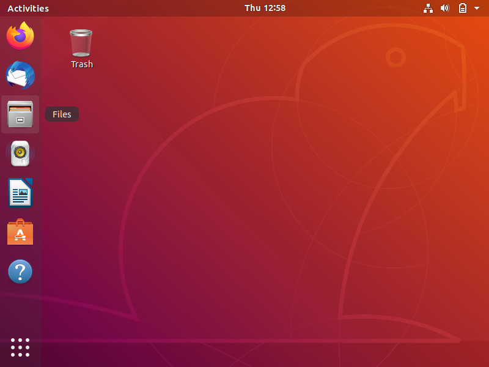

# VSD_RISC-V_based_internship
1 month Research Internship on VSD Squadron Mini based on RISC-V, board is powered by CH32V003F4U6 chip with 32-bit RISC-V core

### Intern: Vijith S
### **College**: SJB Institute of Technology, Bengaluru
### **LinkedIn**: https://www.linkedin.com/in/vijithsatish/
### **Course Instructor**: Kunal Ghosh

---

<b>Task 1:</b> Install the RISC-V toolchain using the VDI. Write a simple C program to calculate the sum of numbers from 1 to n, compile it using the GCC compiler, and check the output. Then, compile the same code using the RISC-V GCC compiler to analyze its generated instructions..
   
 
#### WHAT IS RISC-V?
>RISC-V  is an open-standard instruction set architecture (ISA) based on Reduced Instruction Set Computing (RISC) principles.  RISC-V is a free and open architecture. It is designed to be simple, extensible, and modular, making it suitable for various applications, from small embedded systems to high-performance computing.

## 1. Download the Virtual Disk Image and Install it using Oracle VM Box**

