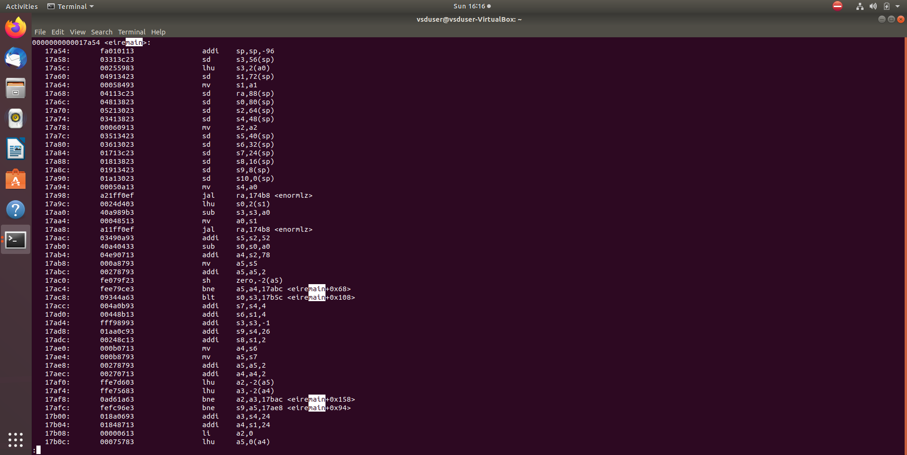

# VSD_RISC-V_based_internship
1-month Research Internship on VSD Squadron Mini based on RISC-V, the board is powered by a CH32V003F4U6 chip with a 32-bit RISC-V core

### Intern: Vijith S
### **College**: SJB Institute of Technology, Bengaluru
### **LinkedIn**: https://www.linkedin.com/in/vijithsatish/
### **Course Instructor**: Kunal Ghosh

---

<details>
<summary><b>Task 1:</b> Install the RISC-V toolchain using the VDI. Write a simple C program to calculate the sum of numbers from 1 to n, compile it using the GCC compiler, and check the output. Then, compile the same code using the RISC-V GCC compiler to analyze its generated instructions.</summary> 
  
<be>


***WHAT IS RISC-V?***
  
>RISC-V  is an open-standard instruction set architecture (ISA) based on Reduced Instruction Set Computing (RISC) principles.  RISC-V is a free and open architecture. It is designed to be simple, extensible, and modular, making it suitable for various applications, from small embedded systems to high-performance computing.

## 1. Download the Virtual Disk Image and Install it using Oracle VM Box


## 2. Write a simple C program to calculate the sum of numbers from 1 to n


## 3. Compile the C code using the GCC compiler, and check the output
```
cd
```
open the sum1ton.c code 
```

leafpad sum1ton.c
```
compile it using gcc compiler 
```
gcc sum1ton.c
```
run the code using the ./a.out
```
./a.out
```


## 4. Compile the C code using the RISC V Processor, and check the output

  the below command compiles the c program using risc v compiler
  
    riscv64-unknown-elf-gcc -o1 -mabi=lp64 -march=rv64i -o 1ton.o 1ton.c

  This command generates an assembly code for the program

    riscv64-unknown-elf-objdump -d 1ton.o


  now we have to locate the main section

    /main



Observations in Assembly Instructions

          The byte address for the main was found to be 10184.
          There were 15 instructions (in hexadecimal: E) when compiled with the -O1 optimization level.
          The address of each consecutive instruction increments by 4 bytes, as observed in the disassembled output.
          
The same commands were run with the -Ofast optimization level instead of -O1, resulting in a reduced number of instructions—12.

     o This demonstrates that the number and type of assembly instructions generated depend on the compilation optimization level used.
     o The higher optimization (-Ofast) produces a more compact and efficient assembly.


</details>

<details>
<summary><b>Task 2:</b> Write a C code to find the lcm of 2 numbers. Compile it using the RISC compiler and simulate it using the spike simulation. Observe the -o1 and -ofast response and debug the assembly level code using spike</summary> 
  
## 1. Simple C Program to find LCM of 2 numbers


## 2. Running the code using GCC and compile it using the risc-v compiler and simulate the output using the SPIKE
the below command is used to run to spike simulation

    spike -d pk lcm.o


## 3. Observe the -o1 and -0fast instruction response using the RISC-V gcc/ SPIKE
-o1 assembly Code


-ofast assembly Code


## 4. Debug the code by using the spike instruction

The below command is used to debug the assembly code using the SPIKE

    spike -d pk lcm.o
    


</details>

<details>
<summary><b>Task 3:</b> Understanding Various RISC V Instructions type. Identify 15 unique RISC-V instructions from riscv-objdmp and Identify exact 32-bit instruction code in the instruction type format for 15 unique instructions</summary> 

# what is RISC-V

  It is an open standard instruction set architecture (ISA) based on established reduced instruction set computer (RISC) principles.

  Base Instruction Formats

  

1. **R-Type (Register-to-Register)**  
- **Purpose**: Used for arithmetic and logical operations involving only registers.  
- **Fields**: `opcode`, `rd` (destination register), `funct3`, `rs1` (source register 1), `rs2` (source register 2), `funct7`.  
- **Example**: `add rd, rs1, rs2`.
  
2. **I-Type (Immediate)**  
- **Purpose**: Instructions involving immediate values, such as arithmetic with a constant or memory load.  
- **Fields**: `opcode`, `rd`, `funct3`, `rs1`, `imm` (immediate value).  
- **Example**: `addi rd, rs1, imm`.

3. **S-Type (Store)**  
- **Purpose**: Used for store operations (writing data to memory).  
- **Fields**: `opcode`, `imm` (split into two parts), `rs1`, `rs2`, `funct3`.  
- **Example**: `sw rs2, imm(rs1)`.

4. **B-Type (Branch)**  
- **Purpose**: Used for conditional branch instructions.  
- **Fields**: `opcode`, `imm` (split into multiple parts), `rs1`, `rs2`, `funct3`.  
- **Example**: `beq rs1, rs2, imm`.

5. **U-Type (Upper Immediate)**  
- **Purpose**: Used to load a 20-bit upper immediate value into the destination register.  
- **Fields**: `opcode`, `rd`, `imm` (20 bits).  
- **Example**: `lui rd, imm`

6. **J-Type (Jump)**  
- **Purpose**: Used for jump instructions.  
- **Fields**: `opcode`, `rd`, `imm` (split into multiple parts).  
- **Example**: `jal rd, imm`.
